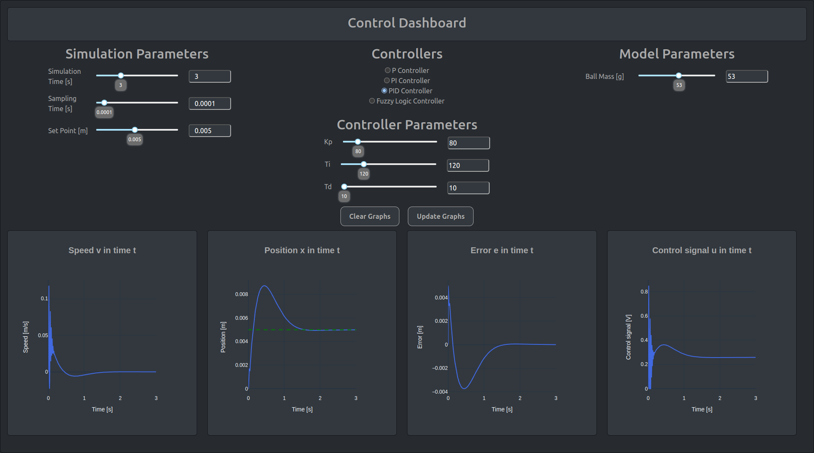
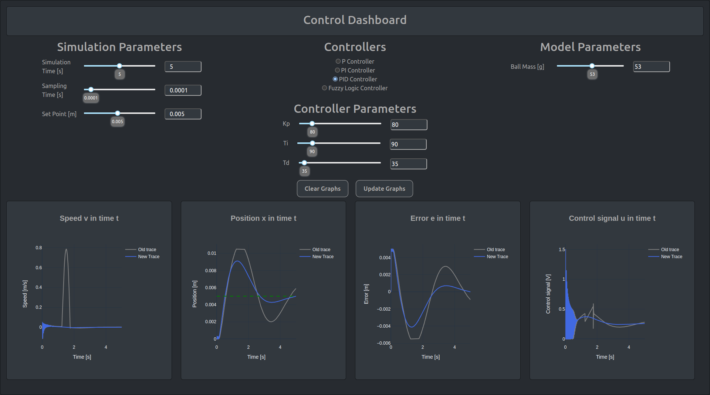
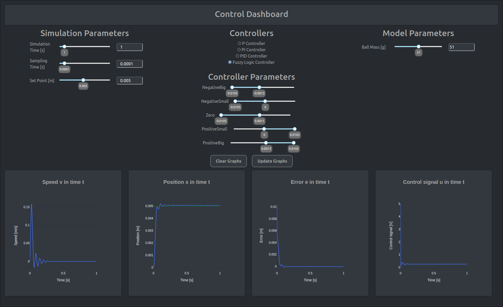
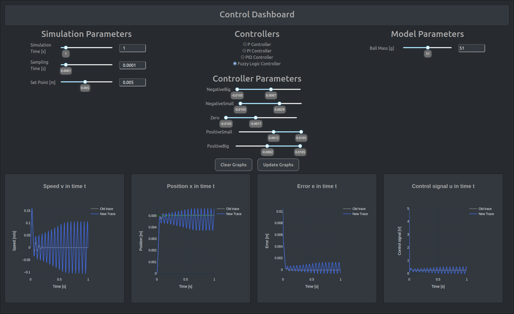

# Control-dashboard
SCADA dashboard for controlling model using various types of controllers.

Project created in collaboration with:
- [Artur Będziechowski](https://github.com/Artur4711)
- [Kinga Banasiak](https://github.com/Kindzix)

Project includes mathematical model of levitating magnetic ball with P, PI, PID, FUZZY regulators and graphs for data visualization.

App was created with use of Dash and Plotly packages.

# PID regulator

# Fuzzy regulator

